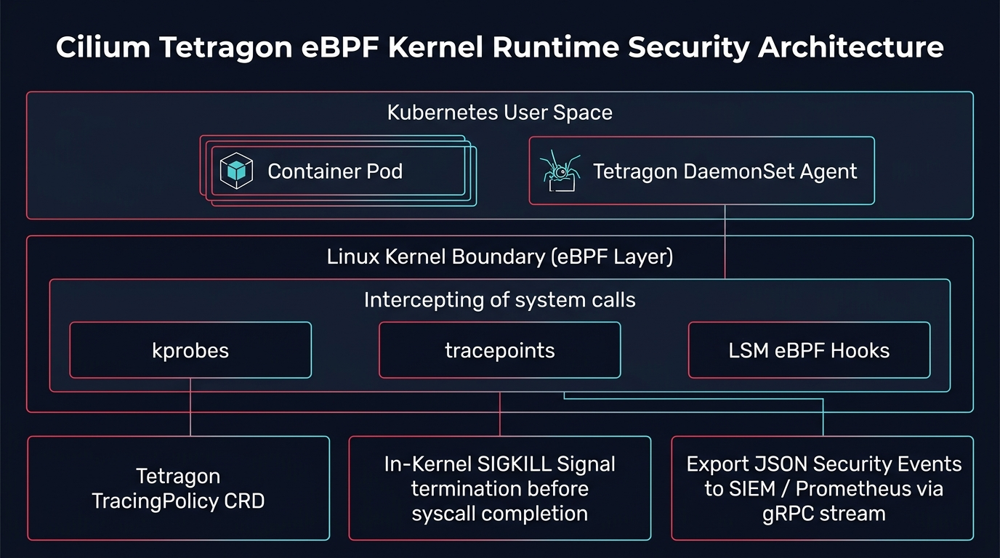

# 🛡️ tp-ebpf-tetragon: Cilium Tetragon eBPF Kernel Runtime Security Studio

Production eBPF runtime security enforcement with **Cilium Tetragon v1.2** for Kubernetes zero-trust architectures.

🔗 **Interactive Studio:** [talaripradeep.info/tools/ebpf-tetragon-security/](https://talaripradeep.info/tools/ebpf-tetragon-security/)



## Core Capabilities

- **In-Kernel Enforcement**: Intercepts Linux syscalls (`sys_execve`, `socket`, `openat`) via eBPF kprobes and LSM hooks.
- **Synchronous SIGKILL**: Blocks container breakouts and namespace escapes instantly in kernel space (<1.8 µs latency).
- **Sensitive File Protection**: Terminates unauthorized attempts to open `/etc/shadow`, Kubernetes service account tokens, or TLS secrets.
- **Low Overhead**: Consumes <0.8% CPU by filtering events inside the kernel ring buffer before reaching userspace.

## Quickstart

```bash
helm repo add cilium https://helm.cilium.io/
helm upgrade --install tetragon cilium/tetragon -f tetragon-values.yaml -n kube-system
kubectl apply -f tracingpolicy-k8s.yaml
```

## License

MIT © 2026 Talari Pradeep
